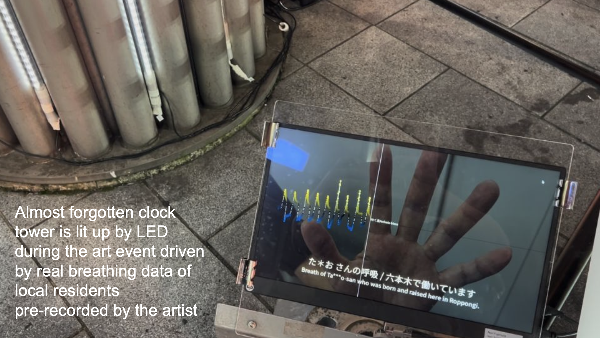
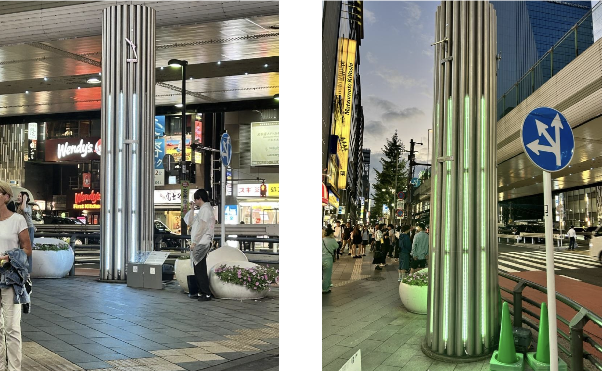
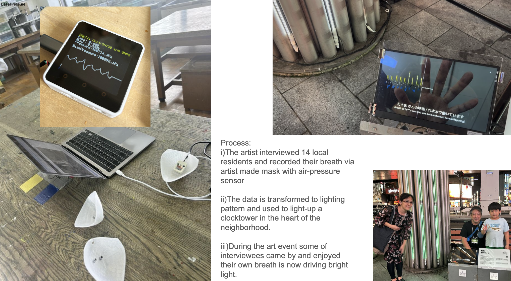
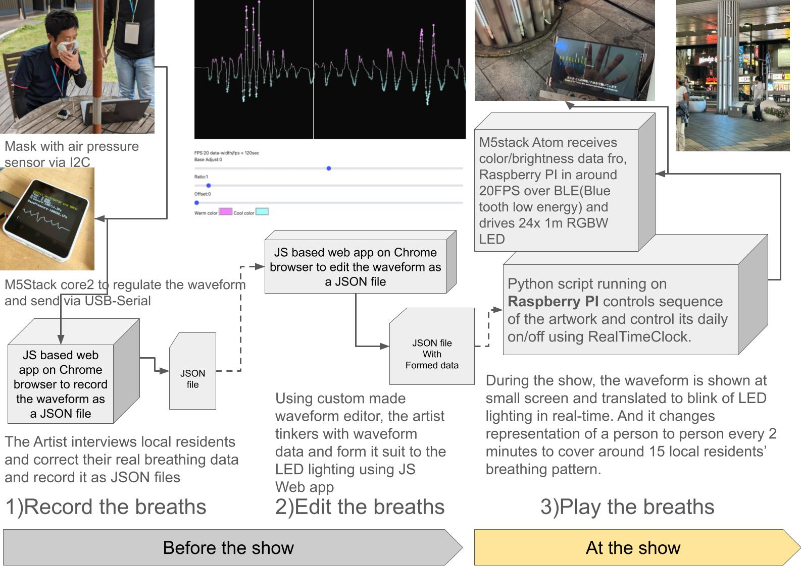

# breathing-clocktower-review
Partial copy of of the repo 'breathing-clocktower' for code review of the artwork 'Breathing Clocktower'
Javascript(Web-app for Chrome to Record and Edit waveforms, WebSerial), Python+pygames+BLE for Visualization and LED control for Raspberry PI, Arduino code for M5Stack ATOM(ESP32 base micro processor) to drive 24*1m LED strips.

## Experience

## Architecture

